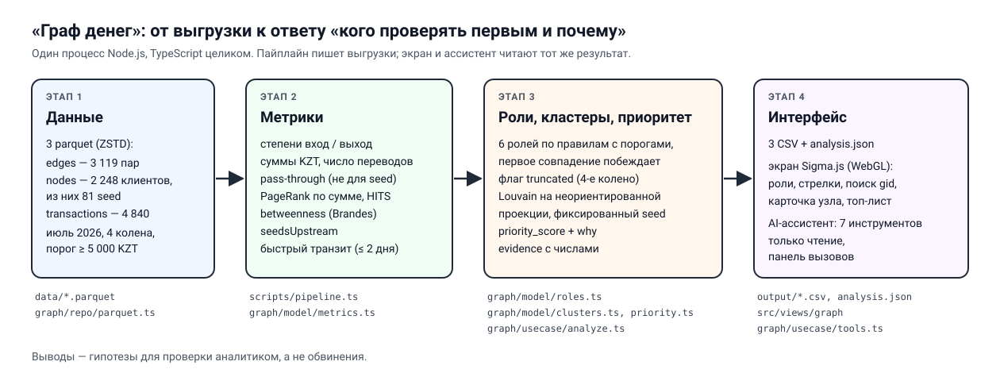

# Граф денег — Money Graph

AML-инструмент аналитика: из 4-хопового графа переводов определяет, **кого из 2 248 клиентов проверять
первым и почему**. HackAlem AI, трек 2 «Граф денег».

> **Эксперты и жюри:** русский раздел ниже самодостаточен — установка, запуск и проверка основного
> сценария без API-ключа, без базы данных и без Docker. Полная документация на английском — в
> разделе [English](#english).

---

## Кратко (RU)

### Что это

«Граф денег» — рабочее место AML-аналитика. На входе — граф исходящих внутрибанковских переводов от
81 известного клиента (seed) на глубину 4 колена: **2 248 узлов, 3 119 рёбер, 4 840 транзакций, июль
2026**. Пайплайн считает метрики каждого узла и присваивает ему **роль** (одну из шести по ТЗ),
**кластер** и **приоритет проверки**, а у каждой строки есть `evidence` — объяснение с числами. Экран
показывает сеть с направлением денег, роли, поиск по gid, карточку узла и топ-лист; AI-ассистент
отвечает на вопросы вида «кого проверять первым и почему?», вызывая инструменты над графом.

**Выводы — это гипотезы для проверки, а не обвинения.** Разметки «виновен / не виновен» в данных нет,
поэтому каждая роль — формальное правило с порогом, которое можно проверить руками.

### Быстрый старт

Нужно: **Node.js ≥ 22** и **pnpm 10** (`corepack enable` включает pnpm, идущий с Node).

```bash
pnpm install
cp .env.example .env          # PowerShell: Copy-Item .env.example .env
pnpm pipeline                 # data/*.parquet → output/*.csv + output/analysis.json, секунды
pnpm dev                      # http://localhost:3000
```

- `pnpm pipeline` читает сырые `data/*.parquet` (лежат в репозитории) и пишет `output/nodes_roles.csv`,
  `output/clusters.csv`, `output/top_nodes.csv`, `output/analysis.json` и `output/run_summary.json`.
  Работает ~3–5 секунд (по ТЗ допустимо до 5 минут), печатает время, число строк и особенности
  данных, и **падает с ошибкой**, если строк не 2 248 или в топ-листе меньше 20.
- `pnpm dev` и `pnpm build` **сами запускают пайплайн** (`predev` / `prebuild`), так что
  `pnpm install && pnpm dev` — достаточно. Явный `pnpm pipeline` нужен, чтобы посмотреть выгрузки
  без запуска сервера.
- CSV — UTF-8 без BOM (так их читает `pandas.read_csv` без параметров, а колонка называется ровно
  `gid`). В Excel открывать через «Данные → Из текста/CSV → UTF-8», иначе кириллица в `evidence`
  отобразится кракозябрами.
- База данных и Docker **не нужны**. `.env.example` уже содержит `LLM_PROVIDER=mock` — ассистент
  работает без ключа и без сети.

### Продакшен-запуск и деплой

На любой машине или сервере с Node.js ≥ 22:

```bash
pnpm install --frozen-lockfile
cp .env.example .env          # для живой модели: LLM_PROVIDER=responses и LLM_API_KEY
pnpm build                    # сам запускает пайплайн, затем собирает Next.js
pnpm start                    # http://localhost:3000; порт меняется переменной PORT
```

Приложение — один Node-процесс, без базы и внешних сервисов. Переменные из таблицы ниже задаются в
`.env` или в окружении хостинга.

### Переменные окружения

| Переменная     | Значение для проверки | Для живой модели       |
| -------------- | --------------------- | ---------------------- |
| `LLM_PROVIDER` | `mock`                | `responses`            |
| `LLM_MODEL`    | не используется       | `gpt-6-luna`           |
| `LLM_API_KEY`  | пусто                 | ключ OpenAI API        |
| `LLM_BASE_URL` | пусто                 | пусто (OpenAI)         |

`mock` — сценарный агент, который вызывает **настоящие** инструменты через тот же диспетчер, что и
живая модель. Ключи никогда не коммитятся.

### Как проверить основной сценарий

1. `pnpm pipeline` — в консоли время выполнения и счётчики строк.
2. Проверить выгрузки: в `output/nodes_roles.csv` ровно **2 248** строк данных (плюс заголовок), в
   `output/top_nodes.csv` — **не менее 20**, в `output/clusters.csv` — строка на кластер с гипотезой.
   Например: `node -e "console.log(require('fs').readFileSync('output/nodes_roles.csv','utf8').trim().split('\n').length - 1)"`
   печатает `2248`.
3. `pnpm dev` и открыть <http://localhost:3000> (по умолчанию тёмная тема, переключатель вверху справа): сеть
   раскрашена по ролям, стрелки показывают направление денег, размер — приоритет. Периферия (80%
   узлов) скрыта по умолчанию — чип «Периферийный» включает её; справа вкладка «Топ».
4. Ввести любой gid из `nodes_roles.csv` в поиск: узел фокусируется, соседи подсвечиваются,
   открывается карточка — роль и сила правила, `evidence`, метрики, крупнейшие контрагенты.
5. В карточке нажать **«Показать путь денег»**: граф по коленам подсвечивает маршрут от seed к
   узлу, внизу — итог («деньги могли дойти за N колен от K seed»). Вкладка «Кластеры» — клик по
   кластеру подсвечивает его на графе.
6. Спросить ассистента **«кого проверять первым и почему?»**, затем **«кто собирает деньги с этих
   пятерых?»** (и, по желанию, «что если убрать первых пятерых?»). В панели активности видно каждый
   вызов инструмента: имя, аргументы, результат и время. Ответ собран из результатов инструментов.

### Выгрузки

| Файл              | Обязательные колонки (порядок по ТЗ)                                        |
| ----------------- | --------------------------------------------------------------------------- |
| `nodes_roles.csv` | `gid, role, role_score, cluster_id, priority_score, evidence`, далее метрики |
| `clusters.csv`    | `cluster_id, n_nodes, n_seed, sum_kzt_internal, top_gids, hypothesis`       |
| `top_nodes.csv`   | `rank, gid, role, priority_score, why`                                      |

Роли: `consolidator`, `transit`, `distributor`, `terminal`, `coordinator`, `peripheral`. Правила и
пороги — в разделе [Method](#method) ниже; те же пороги экспортируются в `output/analysis.json`
(`thresholds`).

### Команда

- **Ораз Исабеков** — контракт данных, интерфейс, README
- **Бекжан** — пайплайн, инструменты агента
- **Саян Кареев** — алгоритм: метрики, роли, кластеры, приоритет

Проект начат с заранее подготовленного шаблона без функциональности по задаче — см.
[раскрытие сторонних компонентов](#third-party-components-and-prior-work).

---

## English

- [What it is](#what-it-is)
- [Quick start](#quick-start)
- [Environment variables](#environment-variables)
- [Checking the main scenario](#checking-the-main-scenario)
- [Outputs](#outputs)
- [Method](#method)
- [Architecture](#architecture)
- [Agent tools](#agent-tools)
- [Limitations](#limitations)
- [Scaling to ~1M nodes](#scaling-to-1m-nodes)
- [Tests and checks](#tests-and-checks)
- [Scripts](#scripts)
- [Team](#team)
- [Third-party components and prior work](#third-party-components-and-prior-work)

## What it is

**Money Graph** («Граф денег») is a tool for an anti-money-laundering analyst. The input is a graph of
outgoing intra-bank transfers collected four hops out from 81 known clients (the _seeds_): **2 248
nodes, 3 119 edges, 4 840 transactions, July 2026**, transfers of at least 5 000 KZT.

From that graph the pipeline assigns every node a **role** (exactly the six from the task), a
**cluster** and a **priority score**, and writes an `evidence` string with numbers for every row. The
screen shows the network with the direction of money and the roles, finds any gid, and opens a card
explaining it. An AI assistant answers questions such as «кого проверять первым и почему?» ("whom do
I check first, and why?") by calling read-only tools over the same analysis.

**Its conclusions are hypotheses for an analyst to verify, not accusations.** The data carries no
ground truth, so every role is a formal rule with a threshold that anyone can check by hand. User
facing text (UI, `evidence`, `why`, `hypothesis`, assistant replies) is in Russian; code is in
English.



## Quick start

Prerequisites: **Node.js ≥ 22** and **pnpm 10** (`corepack enable` activates the pnpm that ships with
Node). No database, no Docker, no API key.

```bash
pnpm install
cp .env.example .env          # PowerShell: Copy-Item .env.example .env
pnpm pipeline                 # data/*.parquet → output/*.csv + output/analysis.json, in seconds
pnpm dev                      # http://localhost:3000
```

- `pnpm pipeline` reads the raw `data/*.parquet` files (committed to the repository, 87 KB) and writes
  `output/nodes_roles.csv`, `output/clusters.csv`, `output/top_nodes.csv`, `output/analysis.json`
  and `output/run_summary.json`. It runs in about 3–5 seconds (the task allows up to five minutes),
  prints its timing, row counts and the dataset's declared quirks, and fails loudly if
  `nodes_roles.csv` does not have 2 248 rows or `top_nodes.csv` has fewer than 20.
- `pnpm dev` and `pnpm build` **run the pipeline first** (`predev` / `prebuild`), so
  `pnpm install && pnpm dev` is enough. Run `pnpm pipeline` on its own to inspect the outputs
  without starting a server.
- The CSVs are UTF-8 without a BOM, which `pandas.read_csv` reads with no options and which keeps
  the first header exactly `gid`. In Excel, open them via Data → From Text/CSV → UTF-8, or the
  Cyrillic in `evidence` will be garbled.
- **Deploy:** on any host with Node.js ≥ 22, run `pnpm install --frozen-lockfile`, copy
  `.env.example` to `.env` (or set the variables in the host's environment), then `pnpm build`
  (runs the pipeline, then builds Next.js) and `pnpm start` (port from `PORT`, default 3000). It is
  a single Node process with no database or external services.

## Environment variables

`.env.example` is complete and ships with `LLM_PROVIDER=mock`, so copying it gives a working product.

| Variable       | Verification      | Live model        | Meaning                                                    |
| -------------- | ----------------- | ----------------- | ---------------------------------------------------------- |
| `LLM_PROVIDER` | `mock`            | `responses`       | `mock`, `responses` (OpenAI Responses API) or `chat`       |
| `LLM_MODEL`    | ignored           | `gpt-6-luna`      | Model id                                                   |
| `LLM_API_KEY`  | empty             | an OpenAI API key | Never commit a real key                                    |
| `LLM_BASE_URL` | empty             | empty             | Only for an OpenAI-compatible endpoint with `chat`         |

**`LLM_PROVIDER=mock` is how reviewers verify the main scenario** (§5.6.6): a scripted agent that
calls the **real** tools through the real dispatcher, with no key and no network. It is the product
with the model removed, not a stub of it — a tool that would refuse still refuses.

The remaining variables in `.env.example` (OpenAI hosted tools) are
inherited from the starter template and are not used by this product.

## Checking the main scenario

1. **Run the pipeline:** `pnpm pipeline`. It prints the timing and the row counts.
2. **Check the outputs:**
   - `output/nodes_roles.csv` has exactly **2 248** data rows plus a header, and the six required
     columns (`gid`, `role`, `role_score`, `cluster_id`, `priority_score`, `evidence`) are filled on
     every row;
   - `output/top_nodes.csv` has **at least 20** rows, sorted by priority;
   - `output/clusters.csv` has one row per cluster, each with a hypothesis.

   A row count that works on any OS:

   ```bash
   node -e "console.log(require('fs').readFileSync('output/nodes_roles.csv','utf8').trim().split('\n').length - 1)"
   ```

3. **Open the screen:** `pnpm dev`, then <http://localhost:3000> (the dark theme shows it best).
   The network is coloured by role (toggle to colour by cluster), arrows show the direction of
   money, and size follows priority. Role chips above the canvas name every colour and toggle a role;
   the peripheral role (80% of nodes) is hidden by default. The right panel opens on «Топ», the
   priority list.
4. **Find a gid:** paste any gid from `nodes_roles.csv` into the search. The node is focused, its
   neighbours are highlighted (even hidden peripheral ones) and its card opens: role and rule
   strength, `evidence`, metrics, and the largest senders and receivers.
5. **Show the money path:** «Показать путь денег» on the card reverse-traces the strongest incoming
   edges up to the seeds and reveals the route on the graph hop by hop, with a one-line summary
   phrased as a route hypothesis. The «Кластеры» tab highlights a cluster on the graph.
6. **Ask the assistant** «кого проверять первым и почему?», then «кто собирает деньги с этих
   пятерых?», optionally «что если убрать первых пятерых?». The activity panel shows every tool call
   — which tool, its arguments, its result and its duration — and the answer is composed from those
   results. Any gid in an answer is clickable.

## Outputs

All three CSVs follow the task's schema exactly. Required columns come first in the task's order;
extra columns may follow.

**`output/nodes_roles.csv`** — one row per node, 2 248 rows.

| Column           | Meaning                                                                  |
| ---------------- | ------------------------------------------------------------------------ |
| `gid`            | Client id, kept as a string (values are ~1e17, above JS's safe integer)  |
| `role`           | One of `consolidator, transit, distributor, terminal, coordinator, peripheral` |
| `role_score`     | 0–1: how far the node clears its role's threshold                        |
| `cluster_id`     | Louvain community                                                        |
| `priority_score` | 0–1: priority for review                                                 |
| `evidence`       | Russian, ≤ 200 characters, with numbers                                  |
| _then_           | extra columns: the metrics below (depth, seed flag, degrees, sums, pass-through, PageRank, HITS, betweenness, seeds upstream, fast transit, truncated) |

**`output/clusters.csv`** — one row per cluster: `cluster_id, n_nodes, n_seed, sum_kzt_internal,
top_gids, hypothesis`. `sum_kzt_internal` sums the edges with both ends inside the cluster;
`hypothesis` is Russian and phrased as something to check.

**`output/top_nodes.csv`** — 50 rows (the task asks for at least 20): `rank, gid, role,
priority_score, why`. `why` names the two or three terms that dominated the score, with their
values.

In every CSV, gids are plain digits, booleans are `true`/`false`, a missing value (for example
`pass_through` of a node that received nothing) is an empty cell, and lists (`top_gids`, `flags`)
are joined with `|`.

**`output/run_summary.json`** — the audit trail of one run: SHA-256 of each input file, row counts,
role counts, timings per stage, and the dataset's declared quirks as warnings (isolated seeds, nodes
that send more than they are observed to receive, depth-4 nodes with no outgoing transfers).

**`output/analysis.json`** — everything the screen and the agent read: stats, the role
`thresholds`, every node with its metrics, verdict and precomputed layout, every edge with first and
last transaction date, clusters and the top list. Its shape is the zod schema in
`src/server/graph/model/graph.schema.ts`.

## Method

### Metrics

Computed on the **directed, weighted** graph, per node:

| Metric                        | Definition                                                                       |
| ----------------------------- | -------------------------------------------------------------------------------- |
| `in_deg`, `out_deg`           | Distinct senders / distinct receivers                                            |
| `in_kzt`, `out_kzt`           | KZT received / sent inside the graph                                             |
| `in_tx`, `out_tx`             | Number of transfers — sums and counts are different signals                      |
| `pass_through`                | `out_kzt / in_kzt`, empty when nothing came in. **Not used for seeds**           |
| `pagerank`                    | PageRank weighted by `sum_kzt`, α = 0.85, dangling mass spread uniformly         |
| `hub`, `authority`            | HITS: hubs send to good collectors, authorities collect from good hubs           |
| `betweenness`                 | Brandes, directed, normalised by (n−1)(n−2)                                      |
| `seeds_upstream`              | How many distinct seeds reach this node along directed edges                     |
| `fast_transit_share`          | Share of outgoing KZT sent within 2 days of an incoming transfer (from dates)    |
| `truncated`                   | Depth 4 and no outgoing edges: the traversal stopped here, not the money         |

Our PageRank, HITS and betweenness were checked against networkx on all 2 248 nodes and agree to
within 1e-14.

### Roles

Every role is a formal rule. The rules are applied **in this order, and the first match wins**.
`role_score` is how far past its threshold the node is: for a value `v` and a threshold `t`,
`(v − t) / (v + t)`, so a node exactly on the line scores 0 and one far past it approaches 1.

<!-- THRESHOLDS: synced from ROLE_THRESHOLDS in src/server/graph/model/roles.ts at 16:50 -->

| # | Role / case      | Rule                                                                                                   | Thresholds (`ROLE_THRESHOLDS`)                                                   | Nodes |
| - | ---------------- | ------------------------------------------------------------------------------------------------------ | -------------------------------------------------------------------------------- | ----- |
| 1 | truncated (flag) | Depth 4 and `out_deg` = 0: the traversal stopped, not the money. Never `terminal`; `consolidator` only if its inputs meet rule 4, else `peripheral` | depth ≥ 4; `role_score` ≤ 0.5                                                    | 444 flagged |
| 2 | `coordinator`    | Early in the chain and branching into the collection/distribution layer: a seed or depth ≤ 1 node that sends to several recipients, through which many consolidators/distributors are reached within 2 hops along several separate branches | depth ≤ 1; `out_deg` ≥ 3; ≥ 15 such nodes within 2 hops; ≥ 3 direct branches      | 16    |
| 3 | `distributor`    | Fan-out: many receivers, few senders                                                                   | `out_deg` ≥ 10 and `out_deg` ≥ 2.5 × `in_deg`                                    | 53    |
| 4 | `consolidator`   | Collects from many and forwards little                                                                 | (`in_deg` ≥ 5, or `in_deg` ≥ 3 with ≥ 2 seeds upstream) and `pass_through` < 0.5 | 94    |
| 5 | `transit`        | Money in ≈ money out, small degrees; forwarding within 2 days raises the score. Never for a seed (its inflow is under-reported) | 0.8 ≤ `pass_through` ≤ 1.2; `in_deg`, `out_deg` ≤ 8; flag `fast_transit` at ≥ 50% forwarded within 2 days | 68    |
| 6 | `terminal`       | Money arrives and stays, and not because the traversal stopped                                         | `out_deg` = 0, depth < 4, and (`in_deg` ≥ 2 or `in_kzt` ≥ 200 000 ₸)              | 219   |
| 7 | `peripheral`     | Everything else; the evidence says which threshold it missed                                           | —                                                                                | 1 798 |

<!-- /THRESHOLDS -->

The applied numbers are exported with every run as `thresholds` in `output/analysis.json`; if this
table and that file ever disagree, the file is what was applied.

For scale, on this data: 51 nodes have `in_deg` ≥ 5; 64 have `out_deg` ≥ 10; 70 non-seed nodes have
`pass_through` between 0.8 and 1.2; 444 nodes are truncated; 1 091 have no outgoing transfers at
depth < 4, of which 219 clear the terminal threshold. The role counts of every run are in
`output/run_summary.json`.

### Anomaly flags

Flags sit beside the role and never change it, its score or the priority. They show as badges on
the node card and in the `flags` column of `nodes_roles.csv` (`src/server/graph/model/anomalies.ts`,
thresholds also exported in `analysis.json`):

| Flag | Rule | Nodes |
| --- | --- | --- |
| `split` (дробление сумм) | one sender made ≥ 3 transfers to the node on the same day, all within ±10% of their median | 6 |
| `sync_inflow` (синхронный приход) | on some day the node received from ≥ 3 distinct payers | 38 |
| `cycle` (возвратный поток) | the node lies on a directed cycle of length ≤ 6 — money comes back | 303 |
| `repeat_route` (повторяющийся маршрут) | middle node B of a chain A→B→C with ≥ 2 transfers on both links, and on ≥ 2 dates B forwarded to C within 2 days of receiving from A | 54 |
| `burst` (всплеск активности) | on some day the node had ≥ 3 transactions and ≥ 3× its mean daily count (needs ≥ 2 active days) | 10 |
| `depth_outlier` (аномальный профиль для колена) | turnover `log1p(in+out)` at or above the 95th percentile of nodes at the same depth (strata ≥ 20 nodes) | 120 |
| `fast_transit` (быстрый транзит) | ≥ 50% of outgoing KZT left within 2 days of an incoming transfer | 275 |
| `truncated` | depth 4 with no outgoing transfers (see Roles) | 444 |

Splitting below the 5 000 KZT extraction threshold is invisible in this data, so `split` can only
under-count.

### Clusters

Louvain community detection (`graphology-communities-louvain`) on the **undirected** projection,
run separately in each weakly connected component, with reciprocal edges merged and weighted by
`log1p(sum_kzt) + 0.25 · log1p(n_tx)`. Direction is dropped **only for clustering** — every metric
and role above uses the directed graph. The random generator is seeded (42), and cluster ids are
ordered by internal KZT, so the same data gives the same clusters on every run. Each cluster gets a
Russian hypothesis generated from its role mix and seed count. On this data: **84 clusters**
(isolated seeds are clusters of one).

### Priority

`priority_score` answers "what to inspect next", not "who is guilty". It is a weighted sum of terms
each normalised to 0–1 (`src/server/graph/model/priority.ts`):

| Term | Weight | Normalisation |
| --- | --- | --- |
| Role strength | 0.25 | role weight × `role_score` (coordinator 1.0, consolidator 0.95, distributor 0.9, transit 0.8, terminal 0.55, peripheral 0) |
| Flow volume | 0.20 | `log1p(in_kzt + out_kzt)` ÷ the maximum |
| Seed reach | 0.15 | `seeds_upstream` ÷ the maximum |
| Betweenness | 0.15 | ÷ the maximum |
| PageRank | 0.15 | ÷ the maximum |
| Cluster seed density | 0.10 | seeds ÷ nodes in the node's cluster |

Then **× 0.75 for a seed** (already known to the analyst) and **× 0.85 for a truncated node**
(outward behaviour unobserved). `why` names the two or three terms that contributed most, with their
values, plus any penalty. No seed reaches the top 50.

### How the data traps are handled

- **Depth-4 truncation.** 444 nodes sit at the fourth hop with no outgoing edges because the
  traversal ended there. They are never `terminal`: they carry the flag `truncated`, their
  `role_score` is capped at 0.5, their priority is penalised, and their evidence says «обход
  остановлен на 4-м колене».
- **Seed inflow is under-reported.** The graph was collected _from_ the seeds along outgoing
  transfers, so money a seed received from outside the sample is missing, and `pass_through` of 20+
  is an artefact of the export. `pass_through` is never used to assign a role to a seed.
- **Sums and counts differ.** One transfer of 4M and forty of 100k give the same `in_kzt`; degrees,
  transfer counts and sums are all kept and all shown.
- **The 5 000 KZT threshold.** Smaller transfers are absent, so a node's degree is a lower bound and
  a "small" flow may be a split one.
- **Fragments.** The graph has 35 weakly connected components: 16 components plus 19 isolated seeds.
  Isolated seeds are kept, get a role like any other node, and are reported as a coverage gap.
- **No ground truth.** There are no labels, so nothing is trained. Explainable rules with thresholds
  let the analyst — and the jury — check any verdict from the node's own numbers in a minute.

## Architecture

One Next.js application, **TypeScript end to end**: the pipeline that writes the CSVs and the
server that answers the agent call the same functions.

```
data/*.parquet
   │  scripts/pipeline.ts            CLI: --data ./data --out ./output; timing and row counts
   ▼
src/server/graph/repo/               file I/O only
   parquet.ts                        readRawGraph: hyparquet + ZSTD; gid → string, date → 'YYYY-MM-DD'
   outputs.ts                        writeOutputs: 3 CSVs + analysis.json
   analysis.ts                       readAnalysis: sync, cached, validated by the zod schema
   ▼
src/server/graph/model/              the pure algorithm: synchronous, no I/O, unit-tested
   graph.schema.ts                   the contract (zod): every shape below
   metrics.ts                        degrees, sums, pass-through, PageRank, HITS, betweenness, …
   roles.ts                          ROLE_THRESHOLDS, assignRoles
   clusters.ts                       Louvain, cluster summaries and hypotheses
   priority.ts                       scorePriority, rankTop
   queries.ts                        node card, collectors, flow trace, removal, coverage gaps
   ▼
src/server/graph/usecase/
   analyze.ts                        metrics → roles → clusters → layout → priority → top
   layout.ts                         ForceAtlas2 with a fixed seed, so the picture never moves
   getAnalysis.ts                    the page's only entry point
   tools.ts                          the seven agent tools
   ▼
src/app/ + src/views/graph           Sigma.js (WebGL) network screen, card, top list, clusters
src/widgets/assistant                chat docked beside the graph, activity panel
src/server/agent/usecase             agent loop, tool registry, prompt, mock adapter
app/api/chat/route.ts                POST /api/chat — the only network call the UI makes
```

The page reads `output/analysis.json`; it never parses parquet at request time, which keeps the
tool handlers synchronous and the screen instant.

**Why TypeScript and not Python.** One runtime means one install for the reviewers, and a project the
experts cannot run is eliminated. The agent's tools call exactly the functions that produced the
CSVs, so the chat and the files cannot disagree. We verified our graph algorithms against networkx
(1e-14) before committing to them; the whole computation takes about a third of a second. The
organiser's Python starter was used as a reference only.

**Code structure.** The interface is Feature-Sliced Design (`app → views → widgets → features →
entities → shared`, importing downward only). The server is `src/server/` in tiers (`kernel` →
`<domain>/model` → `<domain>/repo` → `<domain>/usecase`), also downward only. Both are enforced by
`eslint-plugin-boundaries`, so a violation fails the build. `docs/architecture.md` is the
specification; `docs/plan.md` and `docs/decisions.md` record how the work was split and why.

### Stack

Next.js 16 (App Router) · React 19 · TypeScript · Tailwind CSS 4 · Radix UI · Zod · hyparquet ·
graphology (Louvain, ForceAtlas2) · Sigma.js 3 with `@react-sigma/core` · the OpenAI SDK
(Responses API) · Vitest · ESLint.

### LLM providers

`LLM_PROVIDER` chooses how the agent talks to a model. Tools and loop are identical in all three;
only the wire format changes.

| Value       | Dialect              | Use it for                                          |
| ----------- | -------------------- | --------------------------------------------------- |
| `responses` | OpenAI Responses API | The live model, `gpt-6-luna`                        |
| `chat`      | Chat Completions     | Any OpenAI-compatible endpoint (set `LLM_BASE_URL`) |
| `mock`      | none                 | No key, no network. Reviews and offline demos       |

## Agent tools

All tools are **read-only**, so none needs confirmation. Each validates its arguments with zod
(tool arguments are a model's free text), re-checks that every gid exists and returns a refusal row
otherwise. The dispatcher never throws: a failing tool is a row saying "failed".

| Tool               | Arguments                              | Returns                                                         |
| ------------------ | -------------------------------------- | --------------------------------------------------------------- |
| `get_top_nodes`    | `limit?` (1–50), `role?`, `clusterId?` | Top rows by priority, with `why`                                |
| `get_node`         | `gid`                                  | The node card: metrics, role, evidence, top 5 in and out        |
| `get_cluster`      | `clusterId`                            | The cluster row and its top members                             |
| `find_collectors`  | `gids` (2–20), `maxHops?` (1–4)        | Nodes reached from ≥ 2 of the gids, with the KZT they received  |
| `trace_flow`       | `gid`, `direction`, `maxHops?`         | The sub-graph of edges downstream or upstream of the gid        |
| `simulate_removal` | `gids`                                 | Components and seed reach, before and after removing the gids   |
| `coverage_gaps`    | —                                      | What the data is missing, and the next request to the bank      |

The prompt requires every number in an answer to come from a tool result, every claim to cite its
gids, conclusions to be phrased as hypotheses, and the assistant to say what the data cannot show
(truncation, seed inflow).

## Limitations

- **The sample is one-directional and truncated.** Only outgoing transfers from seeds, four hops,
  one month. Inflows into seeds and anything past the fourth hop are invisible; a truncated node
  cannot be classified as a final recipient.
- **Transfers under 5 000 KZT are absent**, so structuring into small amounts is not visible.
- **Intra-bank only.** Cash, other banks and crypto exits look like terminals or are missing.
- **Rules, not a model.** Thresholds are calibrated on this one dataset and would need re-tuning on
  another; without labels, precision and recall cannot be measured.
- **Roles are exclusive.** A node that both collects and distributes gets the first matching role;
  the metrics in its row show the rest.
- **Louvain is non-deterministic in general**; a fixed seed makes it reproducible, not unique.
  Undirected clustering ignores which way money flows inside a cluster.
- **The assistant can only be as right as its tools**; it explains the rules, it does not add
  knowledge beyond the data.

## Scaling to ~1M nodes

The current design computes everything in memory in a third of a second on 2 248 nodes. At around a
million nodes and tens of millions of transfers it would change in these places:

- **Reading.** Stream the parquet files by row group and column instead of loading them whole;
  build the adjacency directly into compressed sparse (CSR) arrays rather than JS objects.
- **Metrics.** PageRank and HITS become sparse matrix–vector iterations (linear in edges per
  iteration). Exact Brandes betweenness is O(V·E) and becomes infeasible, so switch to
  approximate betweenness by sampling k source pivots. Move heavy computation to a graph engine
  where it pays: igraph or graph-tool on one machine, GraphFrames/Spark or a graph database for a
  bank-scale cluster.
- **Clustering.** Leiden instead of Louvain: faster at scale and guarantees connected communities.
- **Incremental recomputation.** New transactions arrive daily; recompute only the affected
  neighbourhoods and roles, and keep the full recomputation as a nightly job.
- **Interface.** Sigma.js handles on the order of 100k nodes in a browser. Beyond that the screen
  shows cluster summaries and ego-networks around a searched gid, with server-side filtering,
  precomputed tiles and level-of-detail rendering instead of the whole graph.
- **Agent tools.** Back the queries with an index or a graph database (neighbourhood, k-hop,
  top-by-priority) instead of scanning in-memory arrays; the tool contracts stay the same.

## Tests and checks

```bash
pnpm check
```

One command: typecheck, lint at `--max-warnings 0`, and the unit suite, in parallel. Warnings are
failures. It needs nothing running — no database, no API key, no network. The algorithm in
`src/server/graph/model` is covered by unit tests on small hand-built graphs: one per role, plus the
truncation and seed traps.

The starter's structural guards still apply: `src/app/globals.spec.ts` (the stylesheet is built and
follows the token rules), `src/shared/ui/rawControls.spec.ts` (no raw form controls in screens) and
`src/server/agent/usecase/tools.spec.ts` (the tool dispatcher never throws).

## Scripts

| Command                     | What it does                                              |
| --------------------------- | --------------------------------------------------------- |
| `pnpm pipeline`             | `data/*.parquet` → `output/*.csv` + `output/analysis.json` |
| `pnpm dev`                  | Next dev server on <http://localhost:3000>                |
| `pnpm build` / `pnpm start` | Production build and serve                                |
| `pnpm check`                | Typecheck, lint and unit tests in parallel                |
| `pnpm test`                 | Unit tests only                                           |
| `pnpm verify`               | Typecheck and lint                                        |
| `pnpm format`               | Prettier                                                  |

The product uses no database: the starter's optional PostgreSQL/Prisma layer was removed.

## Team

| Member          | Lane                                                          |
| --------------- | ------------------------------------------------------------- |
| Ораз Исабеков   | Data contract, interface, README                              |
| Бекжан          | Pipeline, agent tools, prompt                                 |
| Саян Кареев     | Algorithm: metrics, roles, clusters, priority, queries        |

## Third-party components and prior work

_Required disclosure (§5.4.4). Keep this section accurate._

**Pre-existing template.** The project was started from a general-purpose starter prepared before the
competition, committed as `8d67410 chore: pre-existing hackathon starter template`: the Next.js
application shell, a provider-agnostic LLM agent loop with a tool registry and a domain-free clock
tool, the chat interface with its activity panel, the UI component library, the design-token system
and the lint-enforced architecture. It contained no functionality specific to this task. Everything
addressing the task — the data contract, the pipeline, the metrics, role rules, clustering and
priority, the graph tools, the network screen and this README — was built during the competitive part
and is visible in the commit history after that commit.

**Organiser materials.** The dataset (`data/edges.parquet`, `data/nodes.parquet`,
`data/transactions.parquet`, 4-hop graph of intra-bank transfers, July 2026) and the task
specification were provided by the organisers for use within the hackathon. The organiser's Python
starter code (`starter.py`) was read as a reference for the output schema and the data traps; none of
it is used — our pipeline is our own TypeScript implementation.

**Model.** OpenAI **`gpt-6-luna`** through the OpenAI Responses API (`LLM_PROVIDER=responses`),
proprietary, used under OpenAI's API terms. No model was trained or fine-tuned. `LLM_PROVIDER=mock`
uses no model at all.

**Runtime dependencies** (full list and versions in `package.json`):

| Package                                    | Used for                                   | Licence      |
| ------------------------------------------ | ------------------------------------------ | ------------ |
| `hyparquet`, `hyparquet-compressors`       | Reading the ZSTD parquet files             | MIT          |
| `graphology`                               | Graph data structure                       | MIT          |
| `graphology-communities-louvain`           | Louvain clustering                         | MIT          |
| `graphology-layout-forceatlas2`            | Precomputed layout                         | MIT          |
| `sigma`, `@react-sigma/core`               | WebGL network rendering                    | MIT          |
| `@sigma/node-border`                       | Node halos (glow)                          | MIT          |
| `next`, `react`, `react-dom`               | Application framework                      | MIT          |
| `radix-ui`, `@heroicons/react`, `clsx`     | UI primitives, icons, class names          | MIT          |
| `tailwindcss` (dev)                        | Styling                                    | MIT          |
| `zod`                                      | Schemas and validation                     | MIT          |
| `openai`                                   | OpenAI API client                          | Apache-2.0   |
| `dotenv`                                   | Loading `.env`                             | BSD-2-Clause |
| `server-only`                              | Server/client boundary guard               | MIT          |

Development tooling — TypeScript, ESLint and its plugins, Prettier, Vitest, tsx — each
under its own licence, listed in `package.json`.

The graph algorithms that are not from a library — PageRank, HITS, Brandes betweenness,
`seeds_upstream`, fast transit, the role rules and the priority score — are our own code in
`src/server/graph/model`, validated against networkx.
